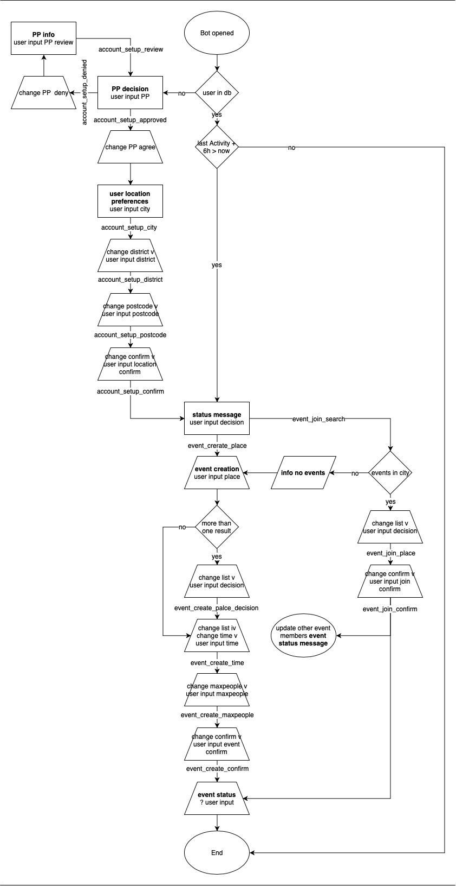

# lunch-bite
 SlackBot backend for the lunch-bite integration.

- [x] `app_home_opened`- link to current status message
  

- [x] `account_setup_approved`
- [x] `account_setup_denied`
- [x] `account_setup_review`
- [x] `account_setup_city`
- [x] `account_setup_district`
- [x] `account_setup_postcode`
- [x] `account_setup_confirm` - link to current status message
  

- [x] `event_create_place`
- [x] custom user input 
- [x] `event_create_place_decision`
- [x] `event_create_time`
- [x] `event_create_maxpeople`
- [x] `event_create_confirm` - link to current status message
  

- [ ] `event_join_search`
- [ ] `event_join_place`
- [ ] `event_join_confirm`
  

 