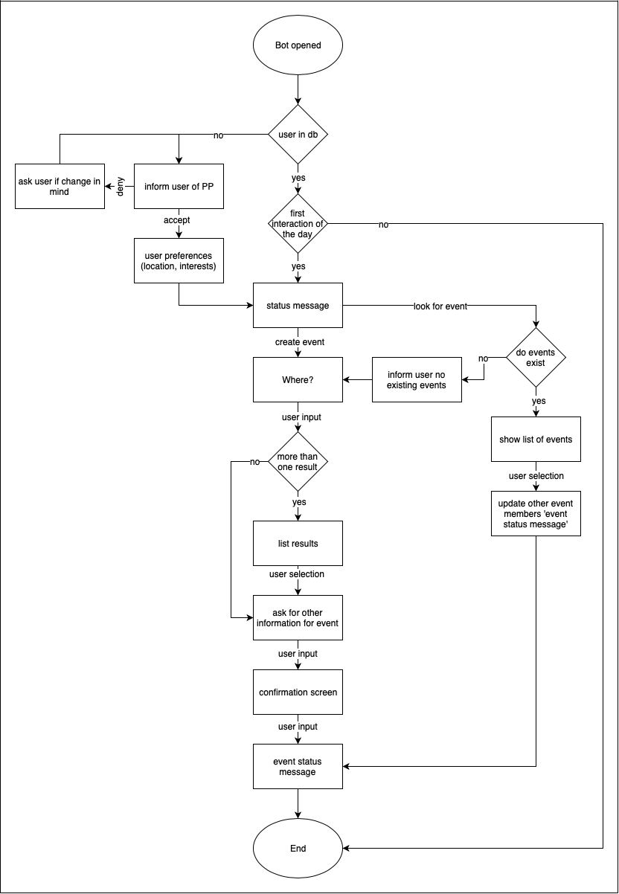

# lunch-bite
 SlackBot backend for the lunch-bite integration.

- [x] `app_home_opened` user verification
- [x] sign up message
- [x] user preferences
- [ ] status message
- [ ] create event
  - [ ] location information (Where?)
  - [ ] here implementation, single place decision
  - [ ] other information
  - [ ] confirm -> create event
- [ ] event status message
- [ ] look for event 
  - [ ] show list of events
  - [ ] update event status message

 